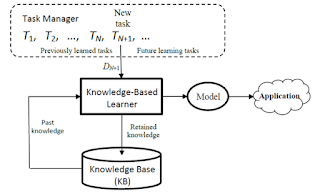

This paper 《Lifelong Learning Memory Networks for Aspect Sentiment Classification》 is published on 2018 IEEE International Conference on Big Data (Big Data) by Shuai Wang from UIC.

There are two main contributions of this paper. First, the authors use memory networks from big unlabeled data to solve the data scarcity problem. Second, they develop a novel model named lifelong learning memory network (L2MN) that can leverage the learned knowledge to new domains.

 In the beginning, let me introduce some background related to this paper.

### Background

**Aspect Sentiment Classification (ASC)** is a hot research area in natural language processing. Traditional Sentiment Analysis (SA) only deals with sentiment towards the whole sentences without deep analysis into the aspects mentioned in the context. This may lose some important information in the sentences. What is more, some review sentences have mixed sentiment sometimes, e.g., in this review "The food in this restaurant is really very good, but the service is very slow, we need to wait for a long time.", the customer holds a positive sentiment towards the aspect "food", but a negative sentiment towards the aspect "service". In this situation, ASC becomes much more important than SA. Benefit from the workshop SemEval, many researchers are working on Aspect-Based Sentiment Analysis (ABSA) in recent years. In SemEval-2014 Task 4, SemEval-2015 Task 12 and SemEval-2016 Task 5, ABSA is divided into four subtasks. Subtask 1 (aspect term extraction) focuses on extract the aspects from the review sentences. Subtask 2 (aspect term polarity) aims to classify sentiment polarity towards the aspect terms. In subtask 3 (aspect category detection), we not only need to extract the aspect terms form the context, but also category these aspect terms into several pre-defined categories. Next, in Subtask 4, sentiment classification is applied towards these aspect categories. To make these subtasks more clearly, let us take two examples. E.g., 1. "I hated their fajitas, but their salads were great." In this example, the sentiment polarity towards the aspect fajitas is negative and the sentiment polarity towards the aspect salads is positive. E.g., 2. "The restaurant was expensive, but the menu was great." In this example, the aspect category "price" has a negative sentiment, while the aspect category "food" has a positive sentiment.

**Memory Network (MN)** was first employed to solve the problem of question answering (QA). The central idea of MN is the inference a long-term memory component, which could be read, written to and jointly learned with the goal of using it for prediction. MN usually consists of four different components. The first part ***I\*** converts inputs to internal feature representation, e.g., a review sentence ***Si.\*** The second part **G** aims to update old memories with the new inputs, e.g., a piece of memory ***Mi\***. The third part **O** generates an output representation given a new input and the current memory state, e.g., a question **Q** + memory matrix *M → O*. The final part ***R\*** combines the different outputs generated by several different hops and generates the final output, e.g., a final response ***A\*** to the question **Q**.

**Lifelong Machine Learning (LML)** focuses on developing versatile systems that accumulate and refine their knowledge over time. We can conclude three key characters of LML from the authors' definition in the book "Lifelong machine learning". From this definition, we can conclude three key characters of LML.

1. Continuous learning process.

2. Knowledge base (explicit knowledge retention and accumulation).

3. The use of previously learned knowledge to help new learning tasks.

   

The following picture shows the workflow of LML. After storing the knowledge of previous tasks into a Knowledge Base (KB), when a new task is coming, it first distills the past knowledge from KB, then the new task combines past knowledge with its own inputs in its model to solve its own problem. After this, the LML system retains the knowledge of this new task into KB for future tasks.

{:style="margin:0 auto"}

Some other machine learning techniques also have similar functions with LML based on its three key characters. Let us make some comparisons here.

**Lifelong Machine Learning (LML) VS Transfer Learning (TL):**

Different from LML which works in a continuous learning process, TL does not need to learn any continuous data with knowledge accumulation. In LML, there are always past domains and a new domain, these domains do not have any direction and they are often in different areas. While in TL, the transfer is always employed from a source domain to a target domain, what is more, the two domains need to be similar to each other.

**Lifelong Machine Learning (LML) VS Multi-task Learning (ML):**

The object of ML is to optimize several subtasks simultaneously in a bigger task. These subtasks do not need to be in the same domain. Different from LML, ML does not need to be employed in a continuous learning process, all the training data from different domains input into the ML model once in the beginning. 

**Lifelong Machine Learning (LML) VS Online Learning (OL):**

Same with LML, OL performs over time with continuous input data. While OL only works on the same learning task, it can not use the past input data to help another new task. As the input data arrives incrementally, the OL model could be much more efficiently with the new coming useful information or knowledge.

**Lifelong Machine Learning (LML) VS Reinforcement Learning (RL):**

The learning process in RL is limited to one task and one environment, the agent gets feedback or rewards based on the environment. Different from LML, there is no concept of accumulating knowledge to help future learning tasks, the environment just has an influence on the current task. 

In this paper, the authors use the ASC Memory Network as a basic model and the model can be integrated into their proposed lifelong learning memory network. So let us first look at the ASC MN (the authors review it as no lifelong learning version NLL). The original ASC MN is published in the paper "Aspect Level Sentiment Classification with Deep Memory Network" by Tang et al. They design a multi-layer (hops) computational model for aspect level sentiment classification. Each layer is a content- and location-based attention model, which first learns the importance/weight of each context word and then utilizes this information to calculate continuous text representation. Finally, the text representation in the last layer is regarded as the feature for sentiment classification. The details of their mode are shown in the following figure.

Here are much more details of this MN model. The target aspect *a* is embedding into a vector **t**, and other words ***x\*** in this sentence are embedding into a vector **m** (the same dimension with ***t\*** ). Through the attention mechanism, the model gets an attention score vector which contains the attention score of each word in *x* towards the target aspect *a*. Some notations and equations are shown in the following figure.

With the result(attention score vector) from the attention layers, the MN model combines the attention score vector with another word vector *c* and the target aspect vector **t** to generate the final aspect-based sentiment score s. In the final step, passing the score s into a softmax function, the model generates the final sentiment probability of this review sentence.

Furthermore, to effectively employ MN in the lifelong learning process, the authors define two knowledge Aspect-Sentiment Attention (ASA) and Context-Sentiment Effect (CSE) from the result of MN. I will introduce some more details of this two knowledge later.

### Algorithm

Up to now, I have introduced all the background knowledge related to the lifelong learning algorithm. Let us go into the algorithm step by step and get a deeper understanding of it.

At first, we need to make a clear understanding of the notations used in the algorithm shown in the following figure. The new domain (gold-labeled data, aspect, and sentiment) and past domains (unlabeled data) are all input data of the algorithm. Notice here, in the two kinds of domain datasets, ***g\*** is much bigger than *l*, because of the unlabeled datasets are much easier to get than the gold-labeled datasets.

Shown in the algorithm figure, **Step1** is Automatic Machine Labeling (line 1-3). In order to make use of these unlabeled data, the authors design an automatic aspect sentiment labeling strategy that does not need human intervention. According to the theory of sentiment consistency, the authors consider that the mentioned aspect should have consistent or similar sentiment orientation as the whole review ratings. In their proposal, they employ two different kinds of methods to label the aspects in the unlabeled datasets. AutoLabelingFull aims to extract all aspects mentioned in the datasets by using an unsupervised aspect extraction approach. While AutoLabelingLite only focuses on the target aspect in the gold-labeled datasets. The outputs of **Step1** are past domains datasets contain aspect labels and sentiment labels. These new past domains datasets here are subsets of the original unlabeled datasets. 

**Step2** aims to Build Classifiers and Raw Knowledge Retention (line 4-8). In order to collect structured information learned by the model, the authors define two types of knowledge attention and sentiment. The attention knowledge is the aspect-sentiment attention distribution. The model generates the attention score of the context (word) *Vi* for target ***t*** under sentiment ***r***. In term of sentiment, the context-sentiment effect is the focus of accumulation. The knowledge can be constructed as a context-sentiment matrix ***M\***. The element in *M* indicates the sentiment effect of a context (word) ***v\*** for sentiment ***k*** in domain ***j***. Then the model adds these two types of knowledge to the knowledge set ***RK\***. Up to now, *RK* only contains some raw knowledge which has noises from auto-labels and mis-classification results. This raw knowledge can not be used directly. 

In **Step3**, the knowledge mining (KnowMining) step mines reliable knowledge from the raw knowledge stored in *RK*. Aspect-Sentiment Attention (ASA) is a kind of reliable knowledge distilling from the raw knowledge attention. In the same way, Context-Sentiment Effect (CSE) corresponds to sentiment. Employing the theory of Frequent Pattern Mining (FPM) with minimum support, the model gets reliable knowledge mining from the raw knowledge. The new reliable knowledge can be supposed as denoised knowledge with the infrequent items or words removed. Finally, after the mining process, two kinds of reliable knowledge **ASA** nad **CSE** will be stored in a knowledge base (KB) to be used in a new domain as prior knowledge. 

At this moment, the lifelong learning memory network (**L2MN**) employs the prior knowledge to a new domain. 

{:.image-caption}

*Model Architecture*

Shown in the model architecture, the final score consists of six different parts. The first part ***S\*** comes from the original aspect and sentence embedding vector ***O\***. With the help of different knowledge from KB, other score parts could be calculated in two different flows. Combining the knowledge from ASA which is separated into positive attention and negative attention with the positive original embedding ***Op\*** and *On*, the model gets two different scores ***Sp\*** and ***Sn.\*** The following figure shows the equations of how to calculate ***Sp\*** and *Sn.* In the equations, A is a polarity-projection vector and B is a polarity-selection vector. 

Furthermore, the sentence-specific matrix *Hq* from KB encodes the prior sentiment effect of the context words in sentence q. Combining *Hq* with the three different attention, the model generates other three different scores. 

After all the six scores generated by the model, the model combines all of them as the final sentiment score which could generate the final sentiment through a softmax function. The final joint score is shown in the following equation. 

In the learning process, the L2MN model is trained in an end-to-end manner by minimizing the cross entropy loss and using stochastic gradient descent. In the shown training loss function equation, g(x,t) denotes a gold sentiment label in the gold-labeled domains datasets. y(x,t) is the model-predicted sentiment distribution for input (x,t). 

### Experiments

In the part of the experiment, most of the candidate models are some base-line methods, we just skip them and talk about some details of several special models. Raw-knowledge Memory Network (RKMN) directly uses the raw knowledge extracted from past domains without further knowledge mining. Aspect-Sentiment Attention L2MN (ASA) is a version of L2MN using ASA knowledge. In addition, Context-Sentiment Effect L2MN (CSE) use CSE knowledge. ASA + CSE L2MN (JOINT) is their proposed lifelong learning memory network which uses both ASA and CSE knowledge. 

There are two different kinds of datasets used in their experiments. One is called Gold Data with gold labels, these datasets are from four different domains, such as Camera, DVD Player, Mp3 and Laptop. Another kind of datasets is called AST data which are treated as past domains. 

In the embedding layer, the authors use the same set of pre-trained word embeddings learned from a Google News corpus for initialization. The dimension of word embeddings is 300 and the learning rate is 0.01. The hyperparameter of FPM (minimum support) in their experiments is set to be 8 for positive and 3 for negative. If we apply the same method, of course, this hyperparameter needs to be fine-tuned based on our own datasets. For the aspect sentiment classification, they try both Binary classification and Three-classes classification. 

The authors use the F1 score as the primary evaluation measure. Especially, they report both the F-Macro and all individual class-based F1 scores in the results. As the original paper has many details of the results of their experiments, I will not talk a lot of details here. 

Following the results part, the authors show two case studies. In the first case study, for the same sentence "however it has failed to deliver on quality", the model L2MN could correctly classify this sentence, however, the model AMN classifies wrong. In this case, "quality" is the target aspect, with the help of the automatically accumulated knowledge, L2MN better identifies that "failed" is an important context for "quality" so it gets higher attention score among the contexts. In the second case, the sentence is "my other gripe is the incredibly crappy remote which is worse than other cheaper apex units." As this sentence is really hard to predict, AMN can not get attention well. On the contrary, with the help of KB, L2MN can identify "scrappy" which is usually a negative sentiment word in the digital domain, in this situation, the attention scores of L2MN are much better than AMN.

To sum up, in this work, the authors employ the idea of lifelong learning and designed a novel three-step lifelong learning approach for ASC. In addition, a new lifelong learning memory network (L2MN) model was developed, which can leverage the meta-mined ASA knowledge and CSE knowledge to help future tasks. Finally, the experiment results demonstrate the effectiveness of their approach. 

In my opinions, the idea is innovative and interesting. With the help of this new L2MN model, we can solve the problem caused by data scarcity, especially the unlabeled data. Their presentation is very clear. In this paper, there are many notations to be defined and the training process has several complex steps. The authors make the notations and equation easily to be understood and show the lifelong learning algorithm very clearly step by step. For myself, I learn a lot in this aspect from them. What is more, the experiment results are also very persuasive. The two case studies are also a highlight in the end. They compare their model and other models by some figures. It helps readers understand the effectiveness of their approach in a detailed way. However, they apply ASC Memory Network as their basic model, I think they should talk more details of ASC MN so that some readers who never read about MN could understand their approach easier. 

#### *Reference:*

Wang, Shuai, et al. "Lifelong Learning Memory Networks for Aspect Sentiment Classification." 2018 IEEE International Conference on Big Data (Big Data). IEEE, 2018.

Pontiki, Maria, et al. "Semeval-2016 task 5: Aspect based sentiment analysis." Proceedings of the 10th international workshop on semantic evaluation (SemEval-2016). 2016.

Tang, Duyu, Bing Qin, and Ting Liu. "Aspect level sentiment classification with deep memory network." arXiv preprint arXiv:1605.08900 (2016).

Z. Chen and B. Liu, “Lifelong machine learning,” Synthesis Lectures on Artificial Intelligence and Machine Learning, 2016.